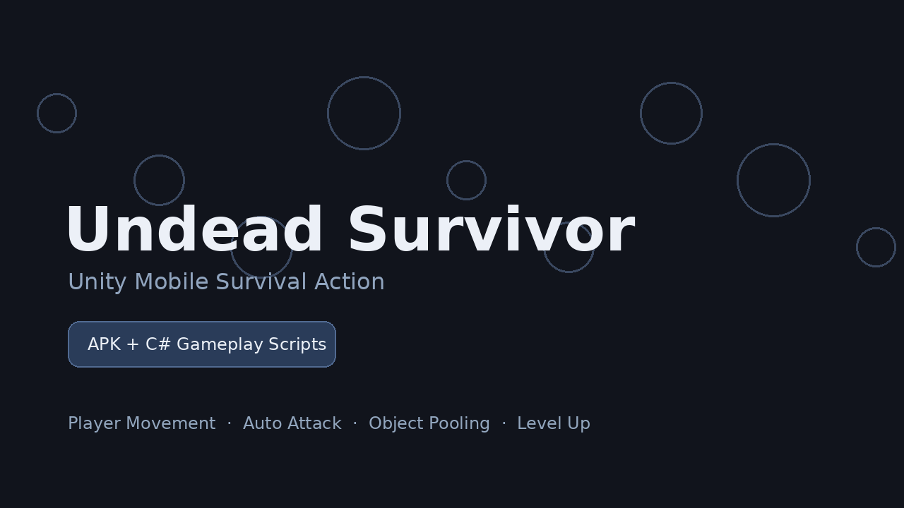

# Undead Survivor

Unity 기반으로 제작한 Android 모바일 생존형 액션 게임입니다.  
플레이어가 몰려오는 적을 피하면서 자동 공격, 무기 성장, 레벨업 보상, 아이템 획득을 통해 오래 생존하는 구조로 구현했습니다.



## 프로젝트 개요

| 항목 | 내용 |
|---|---|
| 장르 | 모바일 생존형 액션 |
| 엔진 | Unity |
| 언어 | C# |
| 플랫폼 | Android |
| 빌드 파일 | APK 포함 |
| 핵심 구현 | 플레이어 이동, 적 스폰, 자동 공격, 오브젝트 풀링, 레벨업, 아이템/무기 성장, 결과 화면 |

## 주요 기능

### 플레이어 이동

입력 벡터를 기반으로 플레이어 이동을 처리하고, 이동 방향에 따라 애니메이션과 캐릭터 방향을 갱신했습니다.

### 자동 공격 시스템

플레이어 주변의 적을 탐지하고, 무기 타입에 따라 투사체 발사 또는 근접 공격이 동작하도록 구성했습니다.

### 적 스폰 시스템

게임 진행 시간에 따라 적을 생성하고, 플레이어 주변 위치를 기준으로 스폰되도록 구현했습니다.

### 오브젝트 풀링

반복적으로 생성되는 적, 투사체, 아이템 오브젝트를 풀링 방식으로 관리하여 런타임 Instantiate/Destroy 비용을 줄였습니다.

### 레벨업 및 아이템 선택

경험치 획득 후 레벨업 시 무기 또는 장비 아이템을 선택할 수 있도록 구성했습니다.

### 게임 결과 처리

게임 종료 시 생존 시간, 처치 수, 승리/패배 상태를 결과 화면에서 확인할 수 있도록 구현했습니다.

## 폴더 구조

```txt
APK/
└─ Android 실행 빌드 파일

Scripts/
└─ 주요 게임 로직 C# 스크립트

Screenshots/
└─ 프로젝트 대표 이미지

Docs/
└─ 게임 흐름 및 구현 정리 문서
```

## 주요 스크립트

| 파일 | 역할 |
|---|---|
| GameManager.cs | 게임 상태, 시간, 레벨, 결과 흐름 관리 |
| Player.cs | 플레이어 이동, 입력, 피격 처리 |
| Enemy.cs | 적 이동, 체력, 피격, 사망 처리 |
| Spawner.cs | 적 생성 및 웨이브 관리 |
| PoolManager.cs | 적/투사체/아이템 오브젝트 풀링 관리 |
| Weapon.cs | 무기 동작 및 공격 처리 |
| Bullet.cs | 투사체 이동과 충돌 처리 |
| Scanner.cs | 주변 적 탐지 |
| Item.cs | 아이템 선택 및 강화 처리 |
| ItemData.cs | 아이템 데이터 정의 |
| LevelUp.cs | 레벨업 선택 UI 처리 |
| Result.cs | 게임 종료 결과 화면 처리 |
| AudioManager.cs | 효과음 및 배경음 관리 |
| AchiveManager.cs | 캐릭터 해금 및 업적 상태 관리 |
| Gear.cs | 장비형 아이템 효과 적용 |
| Hand.cs | 캐릭터 손 위치 및 방향 보정 |
| Hub.cs | 플레이 상태 UI 표시 |
| Reposition.cs | 맵/오브젝트 위치 재배치 |

## 실행 파일

Android 빌드 파일은 `APK/Undead-Survivor.apk`에 포함되어 있습니다.
