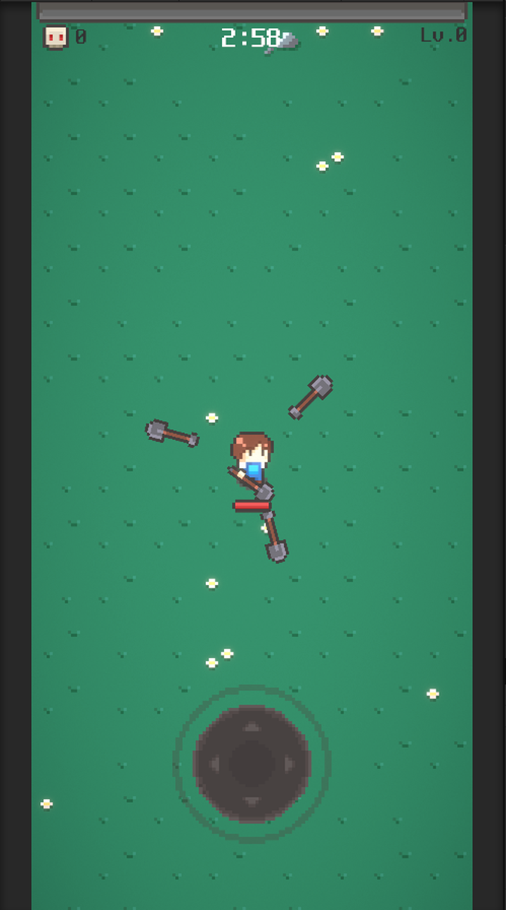
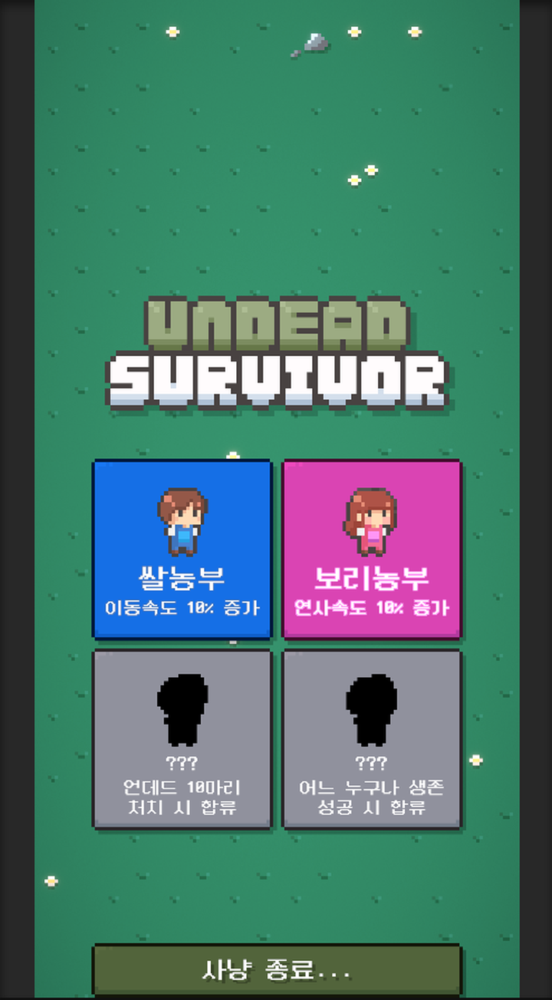
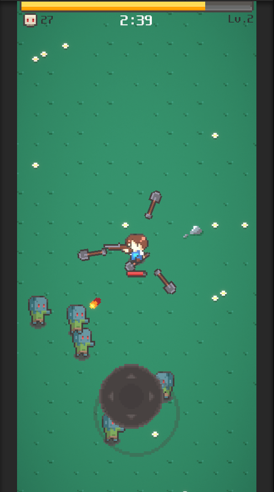
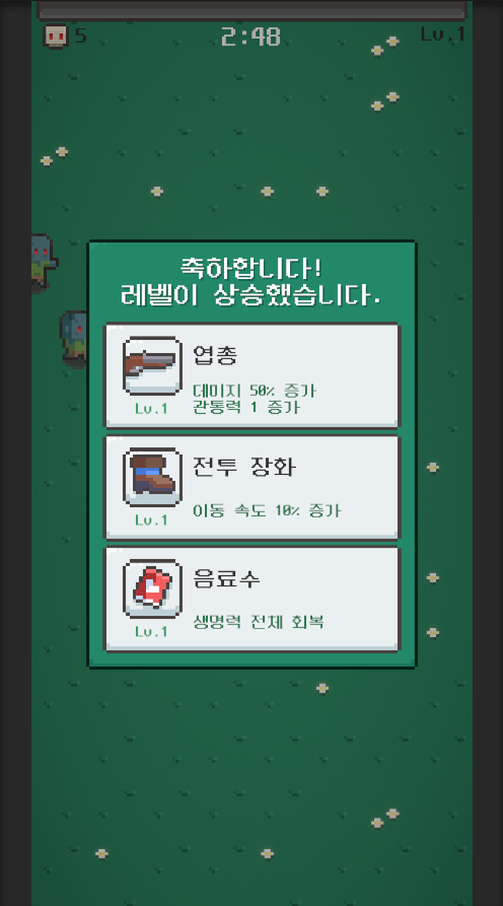
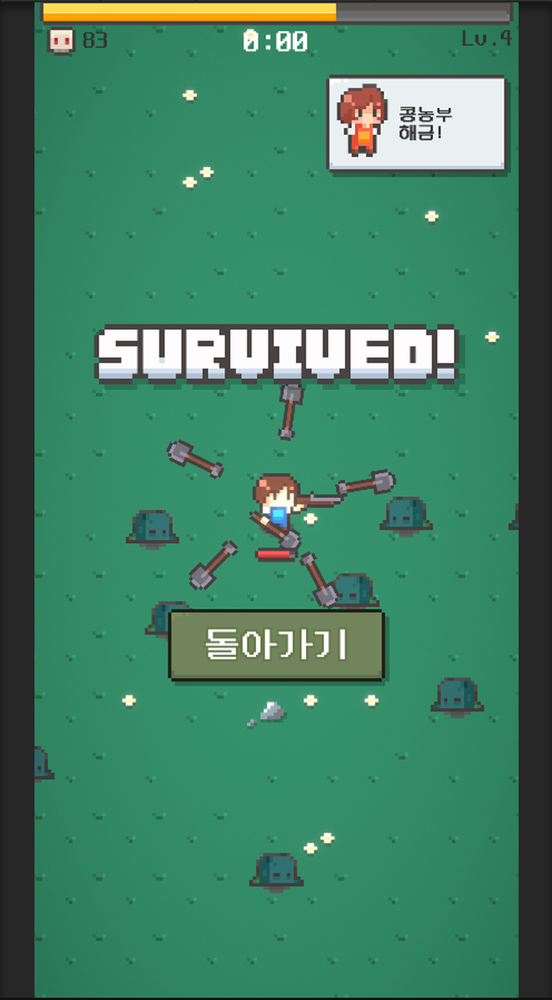

# Undead Survivor



Unity와 C#으로 제작한 Android 기반 모바일 생존형 액션 게임입니다.

플레이어 이동, 자동 공격, 적 스폰, 오브젝트 풀링, 레벨업 보상, 결과 화면까지 이어지는 플레이 루프를 구현했습니다. 저장소에는 주요 C# 스크립트, 진행 흐름 문서, 스크린샷, Android APK 빌드 파일을 정리했습니다.

## 프로젝트 소개

Undead Survivor는 몰려오는 적을 피하며 제한 시간 동안 생존하는 모바일 생존형 액션 게임입니다. 주변 적을 자동으로 탐지하고 공격하며, 적 처치로 얻은 경험치를 통해 무기와 장비를 선택해 성장합니다.

생존 성공 또는 사망 시 결과 화면으로 전환되며, 처치 수와 생존 조건에 따라 캐릭터 해금 상태를 관리합니다.

## 개발 정보

| 항목 | 내용 |
|---|---|
| 프로젝트명 | Undead Survivor |
| 프로젝트 성격 | 모바일게임개발 기말 프로젝트 |
| 개발 형태 | 개인 프로젝트 |
| 개발 기간 | 약 2주 |
| 담당 역할 | 게임 로직 구현, UI 흐름 구성, Android APK 빌드 |
| 장르 | 모바일 생존형 액션 |
| 개발 환경 | Unity, C# |
| 플랫폼 | Android |
| 주요 구현 | 플레이어 이동, 자동 공격, 적 스폰, 오브젝트 풀링, 레벨업, 결과 화면 |

## 기술 스택

- Unity
- C#
- Android
- Object Pooling
- 2D Game System

## 주요 기능

### 플레이어 이동

`Player.cs`는 입력 축을 기반으로 이동 방향을 계산하고 `Rigidbody2D.MovePosition`으로 위치를 갱신합니다. `Character.cs`는 선택 캐릭터에 따른 이동 속도, 공격 속도, 피해량, 투사체 수 보정값을 제공합니다.

### 자동 공격 시스템

`Scanner.cs`가 주변 적 중 가장 가까운 대상을 찾고, `Weapon.cs`가 무기 타입에 따라 근접 회전 공격 또는 원거리 발사를 처리합니다. `Bullet.cs`는 피해량, 관통 횟수, 비활성화 흐름을 담당합니다.

### 적 스폰 시스템

`Spawner.cs`는 진행 시간에 맞는 `SpawnData`를 선택하고 스폰 포인트에 적을 배치합니다. `Enemy.cs`는 플레이어 추적, 피격, 사망, 경험치 지급을 처리합니다.

### 오브젝트 풀링

`PoolManager.cs`는 프리팹 타입별 풀을 관리하고 비활성 오브젝트를 재사용합니다. 적과 투사체처럼 반복해서 등장하는 오브젝트의 생성 비용을 줄였습니다.

### 레벨업 및 아이템 선택

`LevelUp.cs`는 선택 가능한 보상 아이템을 추려 최대 3개를 표시합니다. `ItemData.cs`, `Item.cs`, `Gear.cs`는 아이템 데이터, 선택 처리, 무기와 장비 성장 효과를 연결합니다.

### 게임 상태 및 결과 처리

`GameManager.cs`는 진행 시간, 체력, 레벨, 경험치, 생존 성공과 사망 흐름을 관리합니다. `Result.cs`는 결과 화면을 표시하고, `AchievementManager.cs`는 캐릭터 해금 조건과 안내 문구를 관리합니다.

### 사운드 및 UI 관리

`AudioManager.cs`는 배경음과 효과음을 관리합니다. `HUD.cs`는 경험치, 레벨, 처치 수, 남은 시간, 체력 UI를 갱신합니다.

## 핵심 구현 포인트

- `PoolManager` 기반으로 적과 투사체를 재사용해 반복 생성 비용을 줄였습니다.
- `Scanner`, `Weapon`, `Bullet`을 연결해 자동 전투 흐름을 구성했습니다.
- `GameManager`가 시간, 체력, 경험치, 결과 흐름을 중심에서 관리합니다.
- `ItemData`와 `LevelUp`을 연결해 아이템 선택 기반 성장 구조를 구성했습니다.
- `Player`는 이동 입력만 처리하고 공격은 자동화해 모바일 조작 부담을 줄였습니다.

## 폴더 구조

```txt
undead-survivor-unity/
├─ README.md
├─ .gitignore
├─ APK/
│  └─ Undead-Survivor.apk
├─ Docs/
│  └─ game-flow.md
├─ Screenshots/
│  ├─ gameplay-character-select.png
│  ├─ gameplay-characters.png
│  ├─ gameplay-combat.png
│  ├─ gameplay-dead.png
│  ├─ gameplay-levelup.png
│  ├─ gameplay-main.png
│  └─ gameplay-survived.png
└─ Scripts/
   ├─ AchievementManager.cs
   ├─ AudioManager.cs
   ├─ Bullet.cs
   ├─ Character.cs
   ├─ Enemy.cs
   ├─ GameManager.cs
   ├─ Gear.cs
   ├─ Hand.cs
   ├─ HUD.cs
   ├─ Item.cs
   ├─ ItemData.cs
   ├─ LevelUp.cs
   ├─ Player.cs
   ├─ PoolManager.cs
   ├─ Reposition.cs
   ├─ Result.cs
   ├─ Scanner.cs
   ├─ Spawner.cs
   └─ Weapon.cs
```

## 주요 스크립트

| 파일 | 역할 |
|---|---|
| `AchievementManager.cs` | 처치 수와 생존 조건을 확인해 캐릭터 해금 상태와 안내 문구를 관리 |
| `AudioManager.cs` | 배경음과 효과음 채널 관리 |
| `Bullet.cs` | 투사체 이동, 피해량, 관통 횟수, 비활성화 처리 |
| `Character.cs` | 선택 캐릭터에 따른 능력치 보정값 제공 |
| `Enemy.cs` | 적 추적, 피격, 넉백, 사망, 경험치 지급 처리 |
| `GameManager.cs` | 게임 시작, 시간, 체력, 레벨, 경험치, 결과 흐름 관리 |
| `Gear.cs` | 장비 효과를 공격 주기와 이동 속도에 적용 |
| `Hand.cs` | 캐릭터 방향에 따른 손 위치와 정렬 보정 |
| `HUD.cs` | 경험치, 레벨, 처치 수, 시간, 체력 UI 갱신 |
| `Item.cs` | 보상 아이템 표시와 선택 효과 적용 |
| `ItemData.cs` | ScriptableObject 기반 아이템 데이터 정의 |
| `LevelUp.cs` | 레벨업 보상 후보 표시와 게임 정지/재개 처리 |
| `Player.cs` | 플레이어 이동, 방향 전환, 피격 및 사망 처리 |
| `PoolManager.cs` | 프리팹 타입별 오브젝트 풀 관리 |
| `Reposition.cs` | 플레이 영역 기준 오브젝트 위치 재배치 |
| `Result.cs` | 생존 성공 또는 사망 결과 표시 |
| `Scanner.cs` | 주변 적 탐지와 가장 가까운 대상 선택 |
| `Spawner.cs` | 진행 시간 기반 적 스폰 관리 |
| `Weapon.cs` | 근접 회전 공격과 원거리 발사 처리 |

## APK

Android 빌드 파일은 `APK/Undead-Survivor.apk`에서 확인할 수 있습니다.

## 스크린샷

| 캐릭터 선택 | 전투 화면 |
|---|---|
|  |  |
| 레벨업 보상 | 생존 결과 |
|  |  |

## 데모 영상

아래 링크에서 Android 빌드 기준 게임 플레이 흐름을 확인할 수 있습니다.

[Undead Survivor 시연 영상 보기](https://www.youtube.com/watch?v=Qbc1FhH--z4)

## 참고 자료

구현 과정에서 Unity 모바일 게임 개발 학습 자료와 에셋 리소스를 참고했습니다.

| 구분 | 링크 |
|---|---|
| YouTube 학습 자료 | https://www.youtube.com/playlist?list=PLO-mt5Iu5TeZF8xMHqtT_DhAPKmjF6i3x |
| Unity Asset Store | https://assetstore.unity.com/packages/2d/undead-survivor-assets-pack-238068 |

## 문서

- `Docs/game-flow.md`: 캐릭터 선택부터 결과 화면까지의 게임 진행 흐름을 정리한 문서입니다.

## 향후 개선 방향

아래 항목은 현재 구현된 기능과 구분되는 향후 보완 방향입니다.

- 무기 종류 추가
- 보스전 추가
- 스테이지 확장
- 캐릭터 해금 조건 다양화
- UI/UX 개선
