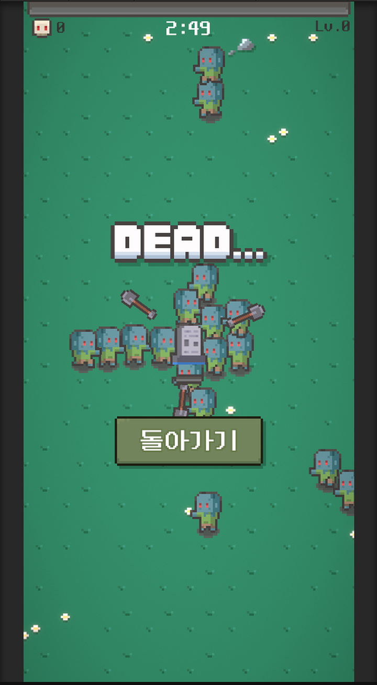

# Undead Survivor

Unity와 C#으로 제작한 모바일 생존형 액션 게임입니다.

몰려오는 적을 피하며 자동 공격, 적 스폰, 오브젝트 풀링, 레벨업 보상, 결과 화면으로 이어지는 기본 플레이 루프를 구현했습니다. 이 저장소는 Unity 기반 모바일 게임의 주요 C# 게임 로직과 Android APK 빌드 파일을 정리한 저장소입니다.

## 프로젝트 소개

Undead Survivor는 플레이어가 몰려오는 적을 피하며 제한 시간 동안 생존하는 모바일 생존형 액션 게임입니다. 플레이어 주변의 적을 자동으로 탐지하고 무기 타입에 따라 공격하며, 적을 처치하면 경험치를 획득합니다.

경험치가 일정 조건에 도달하면 레벨업 보상 UI가 열리고, 플레이어는 무기, 장비, 회복 아이템 중 하나를 선택해 캐릭터를 강화할 수 있습니다. 제한 시간까지 생존하거나 체력이 0이 되면 결과 화면으로 전환되며, 처치 수와 생존 조건을 기준으로 캐릭터 해금 상태도 관리합니다.

- 모바일 생존형 액션 게임
- 플레이어가 몰려오는 적을 피하며 생존
- 주변 적을 자동으로 탐지하고 공격
- 적 처치를 통해 경험치 획득
- 레벨업 시 보상 아이템 선택
- 생존 성공 또는 사망 시 결과 화면 표시
- 캐릭터 해금 및 진행 결과 확인 가능

## 개발 정보

| 항목 | 내용 |
|---|---|
| 프로젝트명 | Undead Survivor |
| 개발 형태 | 개인 프로젝트 |
| 장르 | 모바일 생존형 액션 |
| 개발 환경 | Unity, C# |
| 플랫폼 | Android |
| 주요 구현 | 플레이어 이동, 자동 공격, 적 스폰, 오브젝트 풀링, 레벨업, 결과 화면 |

## 기술 스택

- Unity
- C#
- Android
- Object Pooling
- 2D Game System

## 주요 기능

### 플레이어 이동

`Player.cs`는 Unity 입력 축인 `Horizontal`, `Vertical` 값을 받아 이동 방향을 계산하고, `Rigidbody2D.MovePosition`으로 플레이어 위치를 갱신합니다. `Character.cs`는 선택된 캐릭터 ID에 따라 이동 속도, 공격 속도, 피해량, 투사체 수 보정값을 제공합니다.

이동 중에는 `Animator`의 `Speed` 파라미터를 갱신하고, 좌우 입력에 따라 `SpriteRenderer.flipX` 값을 변경해 캐릭터 방향을 전환합니다. 공격은 별도 버튼 입력 없이 자동으로 처리되므로, 플레이어 조작은 이동에 집중되도록 구성했습니다.

### 자동 공격 시스템

`Scanner.cs`는 `Physics2D.CircleCastAll`로 주변 적을 탐지하고, 가장 가까운 적을 `nearestTarget`으로 저장합니다. `Weapon.cs`는 무기 타입이 근접인지 원거리인지에 따라 공격 방식을 나누어 처리합니다.

근접 무기는 플레이어 주변에 배치된 투사체를 회전시키며 공격 판정을 만들고, 원거리 무기는 일정 주기마다 가장 가까운 적 방향으로 투사체를 발사합니다. `Bullet.cs`는 피해량, 관통 횟수, 이동 방향을 받아 적과 충돌했을 때 관통 횟수를 줄이고 조건에 따라 오브젝트를 비활성화합니다.

### 적 스폰 시스템

`Spawner.cs`는 전체 게임 시간을 스폰 데이터 개수로 나누어 현재 스폰 레벨을 계산합니다. 각 레벨은 `SpawnData`에 정의된 스폰 간격, 적 체력, 이동 속도, 스프라이트 타입을 사용합니다.

적은 스폰 포인트 중 하나에 배치되며, 생성 시 `PoolManager`에서 적 오브젝트를 가져와 재사용합니다. `Enemy.cs`는 활성화될 때 플레이어를 추적 대상으로 설정하고, `FixedUpdate`에서 플레이어 방향으로 이동합니다. 투사체에 맞으면 체력이 감소하고, 사망 시 처치 수와 경험치가 증가합니다.

### 오브젝트 풀링

`PoolManager.cs`는 프리팹 타입별 리스트를 만들고, 요청된 타입의 비활성 오브젝트가 있으면 `SetActive(true)`로 다시 사용합니다. 비활성 오브젝트가 없을 때만 `Instantiate`를 호출해 새 오브젝트를 풀에 추가합니다.

현재 코드에서는 적과 투사체처럼 반복적으로 등장하는 오브젝트가 풀을 통해 재사용됩니다. `Bullet.cs`와 `Enemy.cs`는 조건을 만족하면 `SetActive(false)`로 오브젝트를 비활성화해 다음 사용을 준비합니다.

### 레벨업 및 아이템 선택

`GameManager.cs`는 적 처치 후 `GetExp()`를 통해 경험치를 증가시키고, `nextExp` 조건에 도달하면 레벨을 올린 뒤 `LevelUp` UI를 표시합니다. `LevelUp.cs`는 보상 후보 3개를 무작위로 활성화하고, 선택 중에는 게임 진행을 멈춘 뒤 선택 후 다시 재개합니다.

`ItemData.cs`는 ScriptableObject 기반으로 아이템 타입, 이름, 설명, 아이콘, 기본 피해량, 레벨별 수치, 투사체 프리팹을 정의합니다. `Item.cs`는 선택된 아이템 타입에 따라 무기 생성, 무기 강화, 장비 생성, 장비 강화, 체력 회복을 처리합니다. `Gear.cs`는 장갑과 신발 효과를 무기 공격 주기와 플레이어 이동 속도에 반영합니다.

### 게임 상태 및 결과 처리

`GameManager.cs`는 게임 시작, 진행 시간, 체력, 레벨, 처치 수, 경험치, 생존 성공, 사망 흐름을 관리합니다. `gameTime`이 `maxGameTime`에 도달하면 생존 성공 처리를 실행하고, 플레이어 체력이 0 이하가 되면 게임 오버 흐름을 실행합니다.

`Result.cs`는 결과 화면에서 생존 성공 또는 사망 타이틀을 표시합니다. `AchievementManager.cs`는 처치 수 100 이상, 제한 시간 생존 성공 조건을 확인하고, 캐릭터 해금 상태를 `PlayerPrefs`에 저장합니다.

### 사운드 및 UI 관리

`AudioManager.cs`는 배경음과 효과음을 분리해 관리합니다. 배경음은 반복 재생으로 처리하고, 효과음은 여러 `AudioSource` 채널을 사용해 동시에 재생될 수 있도록 구성했습니다.

`Hub.cs`는 경험치, 레벨, 처치 수, 남은 시간, 체력 UI를 갱신합니다. `Hand.cs`는 캐릭터 방향에 맞춰 손 위치, 회전, 정렬 순서를 보정하고, `Reposition.cs`는 맵 오브젝트와 적이 플레이 영역 밖으로 나갔을 때 위치를 재배치합니다.

## 게임 플레이 흐름

1. 캐릭터 선택: 게임 시작 전 사용할 캐릭터를 선택하고, 해금 상태에 따라 사용 가능 여부를 관리합니다.
2. 게임 시작: `GameManager.GameStart()`에서 선택한 캐릭터 ID와 체력을 설정하고 플레이어를 활성화합니다.
3. 플레이어 이동: `Player`가 입력 축 값을 받아 `Rigidbody2D` 기반 이동과 애니메이션 방향을 처리합니다.
4. 적 스폰: `Spawner`가 진행 시간에 맞는 `SpawnData`를 선택하고 적을 배치합니다.
5. 주변 적 탐지: `Scanner`가 탐지 범위 안의 적 중 가장 가까운 대상을 찾습니다.
6. 자동 공격: `Weapon`이 무기 타입에 따라 회전 공격 또는 원거리 발사를 실행합니다.
7. 적 처치 및 경험치 획득: `Enemy`가 체력 0 이하가 되면 처치 수와 경험치를 증가시킵니다.
8. 레벨업 보상 선택: 경험치 조건을 만족하면 `LevelUp` UI가 열리고 보상 아이템을 선택합니다.
9. 생존 성공 또는 사망: 제한 시간 도달 시 생존 성공, 체력 0 이하 시 사망으로 처리됩니다.
10. 결과 화면 표시: `Result` UI에서 생존 성공 또는 사망 결과를 보여줍니다.

## 폴더 구조

```txt
undead-survivor-unity/
├─ README.md
├─ .gitignore
├─ APK/
│  └─ Undead-Survivor.apk
├─ Docs/
│  └─ game-flow.md
├─ Screenshots/
│  ├─ README.md
│  ├─ gameplay-character-select.png
│  ├─ gameplay-characters.png
│  ├─ gameplay-combat.png
│  ├─ gameplay-dead.png
│  ├─ gameplay-levelup.png
│  ├─ gameplay-main.png
│  └─ gameplay-survived.png
└─ Scripts/
   ├─ AchievementManager.cs
   ├─ AudioManager.cs
   ├─ Bullet.cs
   ├─ Character.cs
   ├─ Enemy.cs
   ├─ GameManager.cs
   ├─ Gear.cs
   ├─ Hand.cs
   ├─ Hub.cs
   ├─ Item.cs
   ├─ ItemData.cs
   ├─ LevelUp.cs
   ├─ Player.cs
   ├─ PoolManager.cs
   ├─ Reposition.cs
   ├─ Result.cs
   ├─ Scanner.cs
   ├─ Spawner.cs
   └─ Weapon.cs
```

## 주요 스크립트

| 파일 | 역할 |
|---|---|
| `AchievementManager.cs` | 처치 수와 생존 성공 조건을 확인해 캐릭터 해금 상태를 저장하고 해금 안내 UI를 표시합니다. |
| `AudioManager.cs` | 배경음과 효과음을 분리해 관리하고, 여러 효과음 채널을 통해 사운드를 재생합니다. |
| `Bullet.cs` | 투사체의 피해량, 관통 횟수, 이동 방향을 설정하고 충돌 또는 범위 이탈 시 비활성화합니다. |
| `Character.cs` | 선택된 캐릭터 ID에 따라 이동 속도, 공격 속도, 피해량, 투사체 수 보정값을 제공합니다. |
| `Enemy.cs` | 플레이어 추적 이동, 피격, 넉백, 사망 처리와 처치 수 및 경험치 증가를 담당합니다. |
| `GameManager.cs` | 게임 시작, 진행 시간, 체력, 레벨, 경험치, 생존 성공, 사망, 재시작 흐름을 관리합니다. |
| `Gear.cs` | 장갑과 신발 장비 효과를 무기 공격 주기 또는 플레이어 이동 속도에 적용합니다. |
| `Hand.cs` | 캐릭터 방향에 맞춰 손 위치, 회전, 스프라이트 방향, 정렬 순서를 보정합니다. |
| `Hub.cs` | 경험치, 레벨, 처치 수, 남은 시간, 체력 UI를 현재 게임 상태에 맞게 갱신합니다. |
| `Item.cs` | 레벨업 보상 아이템 UI를 표시하고, 선택 시 무기/장비/회복 효과를 적용합니다. |
| `ItemData.cs` | ScriptableObject로 아이템 타입, 설명, 아이콘, 레벨별 수치, 투사체 프리팹을 정의합니다. |
| `LevelUp.cs` | 레벨업 보상 후보 3개를 선택해 표시하고, 보상 선택 중 게임 정지와 재개를 처리합니다. |
| `Player.cs` | 입력 축을 받아 플레이어 이동, 애니메이션 방향 전환, 피격 및 사망 흐름을 처리합니다. |
| `PoolManager.cs` | 프리팹 타입별 오브젝트 풀을 관리하고 비활성 오브젝트를 재사용합니다. |
| `Reposition.cs` | 플레이 영역을 벗어난 맵 오브젝트와 적의 위치를 플레이어 이동 방향 기준으로 재배치합니다. |
| `Result.cs` | 생존 성공 또는 사망 결과 타이틀을 결과 화면에 표시합니다. |
| `Scanner.cs` | 탐지 범위 안의 적을 검사하고 가장 가까운 대상을 자동 공격 대상으로 저장합니다. |
| `Spawner.cs` | 진행 시간에 따라 스폰 레벨을 계산하고, 스폰 포인트에 적을 배치합니다. |
| `Weapon.cs` | 무기 타입에 따라 근접 회전 공격 또는 원거리 투사체 발사를 처리합니다. |

## 핵심 구현 포인트

### PoolManager 기반 오브젝트 재사용

`PoolManager.cs`는 프리팹 배열을 기준으로 풀을 만들고, 요청된 인덱스의 비활성 오브젝트를 우선 재사용합니다. `Spawner.cs`는 적을 생성할 때 풀에서 적 오브젝트를 가져오고, `Weapon.cs`는 근접 공격 배치나 원거리 발사에 필요한 투사체를 풀에서 가져옵니다. 이 구조를 통해 반복적으로 등장하는 적과 투사체의 런타임 생성 비용을 줄였습니다.

### Scanner 기반 자동 공격 흐름

`Scanner.cs`가 주변 적을 탐지해 가장 가까운 대상을 저장하면, `Weapon.cs`가 해당 대상을 기준으로 공격을 실행합니다. 원거리 무기는 대상 방향으로 투사체를 발사하고, 근접 무기는 플레이어 주변에 배치된 투사체를 회전시키는 방식으로 공격을 처리합니다. `Bullet.cs`는 공격이 적에게 닿았을 때 관통 횟수와 비활성화 흐름을 담당합니다.

### GameManager 중심 상태 관리

`GameManager.cs`는 `isLive`, `gameTime`, `health`, `level`, `kill`, `exp`를 중심으로 게임 상태를 관리합니다. 게임 시작, 생존 성공, 사망, 경험치 획득, 게임 정지와 재개가 모두 `GameManager` 메서드로 연결되어 있어 플레이 루프의 중심 역할을 합니다.

### ItemData 기반 성장 구조

`ItemData.cs`에 정의된 아이템 데이터는 `Item.cs`에서 UI 표시와 선택 처리에 사용됩니다. `LevelUp.cs`는 레벨업 시 선택 가능한 보상 후보를 보여주고, 선택된 아이템은 무기 생성, 무기 강화, 장비 효과 적용, 체력 회복으로 이어집니다. `Gear.cs`는 장비 아이템의 수치를 실제 공격 주기와 이동 속도에 반영합니다.

### 모바일 환경에 맞춘 단순 조작

`Player.cs`는 이동 입력만 직접 처리하고, 공격은 `Scanner`와 `Weapon` 흐름으로 자동 처리합니다. 플레이어가 이동에 집중할 수 있도록 전투 판단을 자동화해 모바일 생존형 액션 게임에 맞는 단순한 조작 구조를 만들었습니다.

## APK

`APK/Undead-Survivor.apk` 파일을 통해 Android 빌드 결과물을 확인할 수 있습니다.

## 스크린샷

### 캐릭터 선택


### 전투 화면


### 자동 공격


### 레벨업 보상 선택


### 생존 성공 결과


### 사망 결과



## 문서

- `Docs/game-flow.md`: 게임 시작부터 종료까지의 흐름을 정리한 문서입니다.
- `Screenshots/README.md`: 화면 이미지 파일 구성을 정리한 문서입니다.

## 향후 개선 방향

아래 항목은 현재 구현된 기능과 구분되는 향후 보완 방향입니다.

- 무기 종류 추가
- 보스전 추가
- 스테이지 확장
- 캐릭터 해금 조건 다양화
- UI/UX 개선
